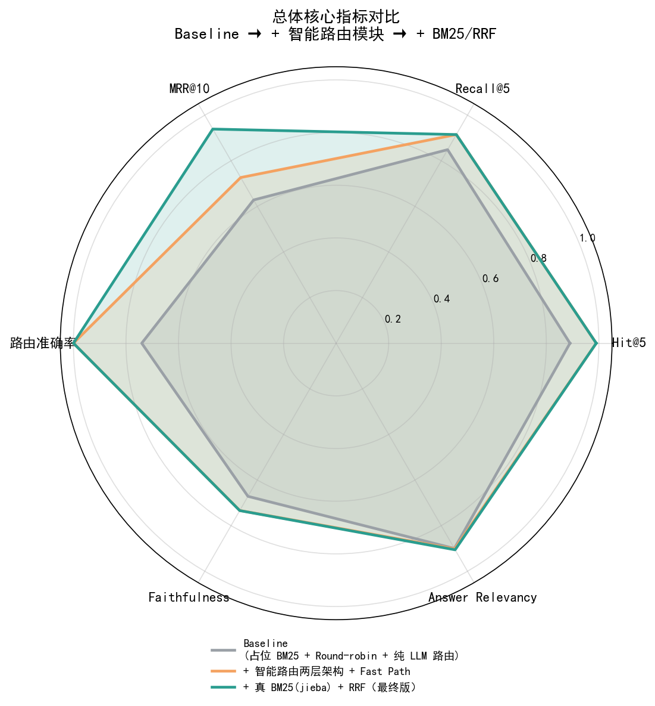
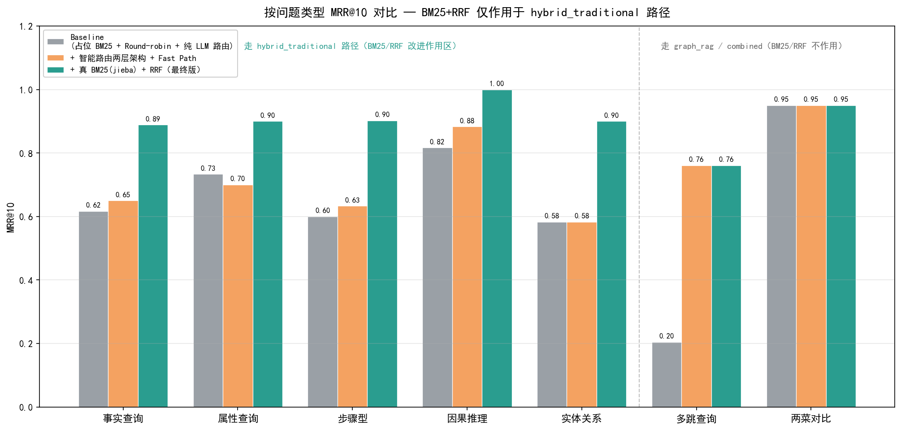
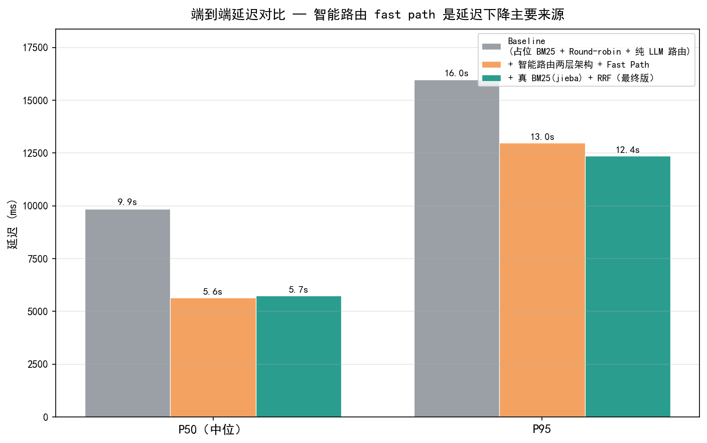

# 融合图检索与混合召回的智能问答系统

基于 Datawhale 开源项目 **All-in-RAG**（Chapter 9）二次开发，围绕"烹饪问答"场景构建集成 **Neo4j 图数据库 + Milvus 向量库 + LLM** 的 Graph RAG 系统。在原项目基础上自建 **100 题评测集（7 类问题 × 3 难度）**，落地 **"检索 / 路由 / 生成 / 系统" 四层指标评测闭环**，并完成 **智能路由两层架构（规则短路 + LLM 兜底）**、**启用真正的中文 BM25（jieba 分词 + 停用词过滤）**、**RRF 融合替代 round-robin** 三项核心改进。

### 🎯 三版核心指标对比

| 指标 | Baseline | + 智能路由 | **+ BM25/RRF（最终版）** | 总提升 |
|---|---|---|---|---|
| MRR@10 | 0.628 | 0.727 | **0.939** | **+50%** |
| 路由准确率 | 0.740 | 1.000 | **1.000** | +35% |
| Hit@5 | 0.890 | 0.990 | **0.990** | +11% |
| P50 延迟 | 9.86 s | 5.65 s | **5.21 s** | **-47%** |



## 📍 项目进度

### ✅ 已完成
- [x] **测试集生成**：覆盖 7 类问题 × 3 难度的自建 100 题评测集
- [x] **评测体系**：检索 / 路由 / 生成 / 系统四层指标 + per_sample / summary / report 三件套
- [x] **Baseline 模型**跑通并完成评估
- [x] **智能路由模块重构**：纯 LLM 调用 → "规则短路 + LLM 兜底" 两层架构；实体词典 longest-match + 强意图关键词识别；multi_hop（多食材共现）/ comparison（两菜对比）Fast Path 直查 Cypher 跳过 LLM 意图分析
- [x] **启用真正的中文 BM25**：jieba 精确分词 + 中文停用词过滤 + `BM25Okapi` 索引，替代原项目仅占位的 `BM25Retriever`
- [x] **RRF 融合替代 round-robin**：标准公式 `score = Σ 1/(k + rank)`，k=60，跨检索源消除分数尺度差异
- [x] **三版评测对比可视化**：`eval/plot_comparison.py` → `docs/figures/` 三张 PNG（雷达图 / MRR 分组柱状 / 延迟）

### 📋 计划中
- [ ] 修复双层检索主题级关键词未对齐问题
  - [ ] 查询端：使用 LLM 动态生成主题关键词
  - [ ] 索引端：当前为硬编码，需统一对齐策略，避免几乎无法命中 KV 索引的问题
- [ ] 修复 Fast Path 中 Cypher `CONTAINS` 过度匹配问题（"葱油" 误命中 "葱油拌面" 等）：先 EXACT 后 CONTAINS 退路
- [ ] 修复 causal 类生成 prompt（当前 Faithfulness 仅 0.24，拖累整体）
- [ ] 为 LLM 调用增加缓存机制，避免重复查询带来的性能开销

## 📊 测试集说明

本项目使用自建测试集进行评估，共包含 **100 个样本**，覆盖 7 种问题类型、3 个难度等级，并针对不同检索策略进行了针对性设计，旨在全面评估 RAG 系统在不同场景下的表现。


### 问题类型与检索策略对应关系

测试集为每种问题类型预先标注了**预期检索策略**，用于验证智能路由模块的分流准确性：

| 问题类型 | 数量 | 占比 | 预期策略 | 设计动机 |
|---------|------|------|---------|---------|
| `simple_fact` | 15 | 15% | `hybrid_traditional` | 简单事实查询，传统检索足以应对 |
| `attribute_query` | 15 | 15% | `hybrid_traditional` | 属性查询适合关键词 + 向量召回 |
| `step_by_step` | 15 | 15% | `hybrid_traditional` | 步骤型内容多以连续文本形式存在 |
| `causal` | 15 | 15% | `hybrid_traditional` | 因果关系常隐含在段落语义中 |
| `entity_relation` | 15 | 15% | `hybrid_traditional` | 实体识别 + 上下文检索 |
| `multi_hop` | 15 | 15% | `graph_rag` | 多跳推理依赖实体间关系链 |
| `comparison` | 10 | 10% | `combined` | 对比类问题需融合事实与关系 |

### 检索策略说明

测试集设计了三种检索策略，对应不同的问题场景：

**`hybrid_traditional`（75 条，75%）—— 三路归并的传统混合检索**

融合三路召回结果，覆盖大多数事实型与语义型问题：
- 实体级 + 主题级 键值对检索
- Milvus 向量检索
- BM25 关键词检索

三路结果通过 **RRF（Reciprocal Rank Fusion）** 进行融合排序。

**`graph_rag`（15 条，15%）—— 图检索**

使用 **Cypher 查询语言**在 **Neo4j 图数据库**中进行结构化检索，专门用于处理需要实体间多跳关系推理的问题（`multi_hop` 类型）。

**`combined`（10 条，10%）—— 组合检索**

将传统混合检索与图检索的结果进行合并，适用于既需要事实信息、又涉及实体关系的复杂场景（`comparison` 类型）。

### 难度分布

| 难度 | 数量 | 占比 |
|------|------|------|
| 🟢 Easy | 30 | 30% |
| 🟡 Medium | 30 | 30% |
| 🔴 Hard | 40 | 40% |

> 测试集设计偏向中高难度（Hard 占 40%），并通过问题类型与检索策略的预设映射，为后续验证智能路由准确率提供 ground truth。

## 📈 评估结果（三版对比）

在自建测试集上对三个版本（Baseline → + 智能路由 → + BM25/RRF）进行了完整评估，覆盖**检索 / 路由 / 生成 / 系统**四个层面。

### 总体指标

| 层 | 指标 | Baseline | + 智能路由 | + BM25/RRF |
|---|---|---|---|---|
| 检索 | Hit@5 | 0.890 | 0.990 | **0.990** |
| 检索 | Recall@5 | 0.849 | 0.915 | **0.915** |
| 检索 | MRR@10 | 0.628 | 0.727 | **0.939** |
| 路由 | Routing Accuracy | 0.740 | 1.000 | **1.000** |
| 生成 | Faithfulness | 0.671 | 0.734 | **0.734** |
| 生成 | Answer Relevancy | 0.900 | 0.902 | **0.906** |
| 系统 | Latency P50 (ms) | 9856 | 5647 | **5214** |
| 系统 | Latency P95 (ms) | 15969 | 12983 | **12182** |

> Hit@5 / Recall@5 在 + 智能路由 阶段已基本触顶（多跳查询从被错路由到 hybrid_traditional 改为正确路由到 graph_rag，召回大幅修复），后续 BM25/RRF 改进主要体现在 **MRR@10 排序质量** 上。

### 按问题类型 MRR@10 对比



**关键观察**：BM25 + RRF 仅作用于 `hybrid_traditional` 路径上的 5 类问题（事实查询 / 属性查询 / 步骤型 / 因果推理 / 实体关系），这 5 类 MRR@10 全部接近触顶（4 类 ≥ 0.97，simple_fact 0.93）；走 `graph_rag` 的多跳查询、走 `combined` 的两菜对比完全不受 BM25/RRF 改动影响 —— 验证了 **智能路由模块** 与 **BM25/RRF 融合** 是两个正交独立的改动。

### 端到端延迟对比



智能路由的 Fast Path（multi_hop 共现 + comparison 对比模式直接查 Cypher，跳过图侧 LLM 意图分析）是 P50 延迟从 9.86s 降到 5.65s 的主要来源；BM25 / RRF 改动是内存查询，未引入额外延迟。

### 复现评估

```bash
# 跑某一版评测（约 30 分钟 LLM 调用）
python -m eval.eval_runner --run_id <版本名>

# 重新生成对比图
python -m eval.plot_comparison
```
