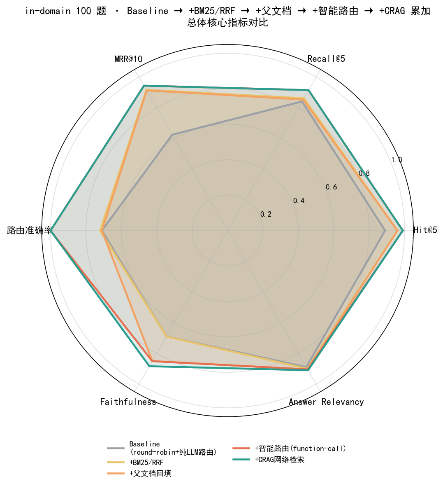
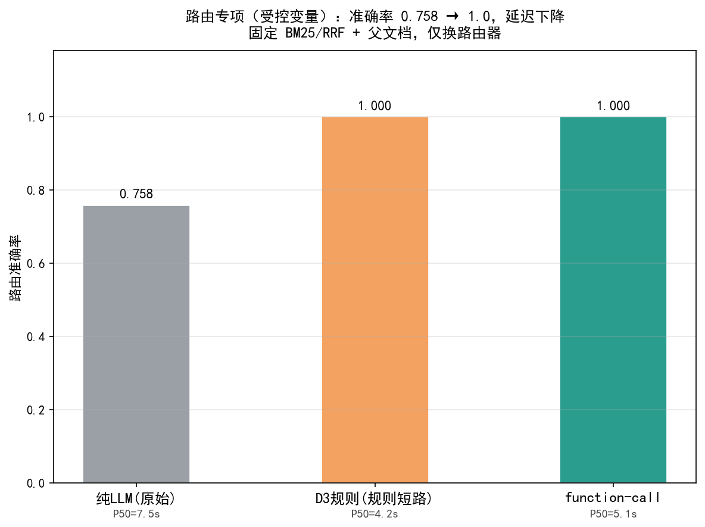
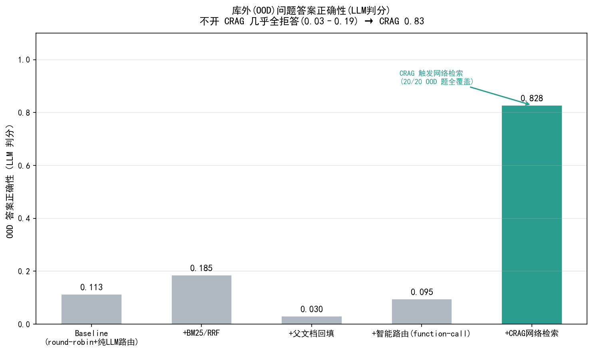
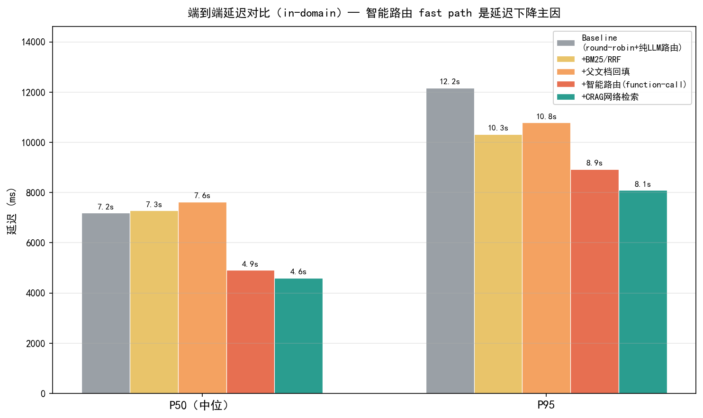

# 融合图检索、混合召回与网络纠错的智能问答系统

基于 Datawhale 开源项目 **All-in-RAG**（Chapter 9）二次开发，围绕"烹饪问答"场景构建集成 **Neo4j 图数据库 + Milvus 向量库 + LLM** 的 Graph RAG 系统。在原项目基础上自建 **评测集（7 类问题 × 3 难度，120 题 = 100 库内 + 20 库外）**、落地 **"检索 / 路由 / 生成 / 系统" 四层指标评测闭环**，并完成四项核心改进：

1. **真正的中文 BM25（jieba 分词 + 停用词）+ RRF 融合**替代 round-robin（已合并入原项目 PR #106）
2. **父文档回填（small-to-big）** 消除长菜谱步骤/食材上下文的非确定性截断（已合并入原项目）
3. **智能路由两版迭代**：规则短路两层架构 → LLM function-calling 自主选路
4. **CRAG 网络纠错（Corrective-RAG）**：生成前自评上下文是否充分，不足则触发 Tavily 网络检索补答，解决库外问题

### 🎯 核心指标：五版累加消融（in-domain 100 题）

| 指标 | Baseline | +BM25/RRF | +父文档 | +智能路由 | **+CRAG** |
|---|---|---|---|---|---|
| MRR@10 | 0.625 | **0.917** | 0.913 | **0.944** | 0.944 |
| Hit@5 | 0.890 | 0.960 | 0.960 | **0.990** | 0.990 |
| Faithfulness | 0.690 | 0.691 | **0.850** | 0.851 | **0.884** |
| 路由准确率 | 0.710 | 0.720 | 0.710 | **1.000** | 1.000 |
| P50 延迟 | 7.19 s | 7.28 s | 7.63 s | **4.91 s** | 4.60 s |



> **读法（累加式消融）**：每一列在前一列基础上叠加一个模块。BM25/RRF → 检索排序跃升（MRR 0.625→0.917）；父文档 → 忠实度跃升（Faithfulness 0.69→0.85）；智能路由 → 检索再升 + 延迟大降（路由准确率→1.0，P50 7.2s→4.9s）；CRAG → 库内零回归（Faithfulness 还升到 0.884）。
>
> *累加式消融的相邻差值是"在已有模块之上再加该模块"的边际收益，非模块的独立贡献；路由维度另用受控变量法单独隔离（见下）。*

## 🧩 智能路由：两版迭代 + 受控变量对比

路由经历两次迭代：**①规则短路两层架构（规则命中直接出策略、未命中再调 LLM）→ ②LLM function-calling 自主选路**。固定检索管线（BM25/RRF + 父文档）、只切换路由器做受控对比：

| 路由器 | 路由准确率 | P50 延迟 | P95 延迟 |
|---|---|---|---|
| 纯 LLM（datawhale 原始） | 0.758 | 7.48 s | 10.96 s |
| 规则短路（第一版改进） | **1.000** | **4.15 s** | **7.98 s** |
| function-calling（第二版改进） | **1.000** | 5.13 s | 8.97 s |



两版自研路由都把准确率从 0.758 拉满到 1.0、延迟大幅下降；规则版最快（多跳/对比类走 Fast Path 直查 Cypher，免去图侧 LLM 意图分析），function-calling 版同样满分且更易扩展新检索源。

## 🌐 CRAG 网络纠错：解决库外（OOD）问题

知识库未收录的菜（西餐、日餐、东南亚菜等）问出来时，纯本地检索只能召回不相关菜谱。CRAG 在生成阶段先**自评检索上下文是否足以回答**：充分则直接答（库内零额外开销），不足则改写检索词、调 **Tavily 网络检索**补充上下文后再生成。

在 20 题库外测试集上，用 **LLM 判分正确性**（对照人工 ground_truth 打分，拒答≈0、答对≈1）衡量：



- **不开 CRAG**：系统对库外问题诚实拒答（"知识库没有此菜"，不瞎编），LLM 判分正确性仅 **0.03–0.19**。
- **开 CRAG**：全部触发网络检索作答，正确性升至 **0.83**（约 4–8 倍）。
- **机制可靠性**：库外 **20/20 全触发**网络检索、**Tavily 0 失败**、库内 **0/100 误触发**（不该触发时绝不画蛇添足）。

> *库外问题无 gold 节点，故不报检索指标；也不报 Faithfulness——它衡量"答案被检索片段支撑的比例"，而 Tavily 短 snippet 撑不起完整菜谱、非 CRAG 的简短拒答反而易被判支撑，对库外有误导。库外答案质量以 LLM 判分为准。*

## ⏱️ 端到端延迟



智能路由的 Fast Path（多跳共现 / 两菜对比模式直查 Cypher，跳过图侧 LLM 意图分析）是 P50 从 7.2s 降到 4.9s 的主要来源；BM25/RRF、父文档是内存/单次查询，未引入额外延迟；CRAG 仅在库外问题（约占评测 1/6）触发一次额外网络往返。

## 📊 评测集说明（120 题 = 100 库内 + 20 库外）

自建测试集，覆盖 **7 种问题类型 × 3 难度**，并为每题预标注**预期检索策略**，用于验证智能路由分流准确性。

### 库内 100 题：问题类型与检索策略

| 问题类型 | 数量 | 预期策略 | 设计动机 |
|---|---|---|---|
| `simple_fact` | 15 | `hybrid_traditional` | 简单事实查询，传统检索足以应对 |
| `attribute_query` | 15 | `hybrid_traditional` | 属性查询适合关键词 + 向量召回 |
| `step_by_step` | 15 | `hybrid_traditional` | 步骤型内容多以连续文本形式存在 |
| `causal` | 15 | `hybrid_traditional` | 因果关系常隐含在段落语义中 |
| `entity_relation` | 15 | `hybrid_traditional` | 实体识别 + 上下文检索 |
| `multi_hop` | 15 | `graph_rag` | 多跳推理依赖实体间关系链 |
| `comparison` | 10 | `combined` | 对比类问题需融合事实与关系 |

### 库外 20 题（OOD，验证 CRAG）

枚举 Neo4j 全部菜名做**避让名单**，构造 20 道**库里没有**的菜（西/日/东南亚/印度等），含人工撰写 ground_truth；类型为 10 `step_by_step` + 10 `entity_relation`，`source_node_ids` 为空、`metadata.domain = out_of_domain`。评测按 domain 切分，库内/库外分别聚合。

### 三种检索策略

- **`hybrid_traditional`** —— 三路召回（实体级+主题级键值对 / Milvus 向量 / BM25 关键词）经 **RRF（Reciprocal Rank Fusion, k=60）** 融合，命中后做**父文档回填**。
- **`graph_rag`** —— 在 Neo4j 用 **Cypher** 做结构化检索，处理多跳关系推理（`multi_hop`）。
- **`combined`** —— 合并传统混合检索与图检索，适用既需事实又涉关系的复杂场景（`comparison`）。

## 🔬 评测方法学

- **检索层**：Hit@5 / Recall@5 / MRR@10（库外无 gold 节点，不适用）
- **路由层**：Routing Accuracy（对照预标注策略）
- **生成层**：Faithfulness / Answer Relevancy（手搓 RAGAS）；库外另用**答案正确性 vs ground_truth**（LLM 判分 + embedding 余弦）
- **系统层**：Latency P50 / P95
- **消融方法**：主链=累加式（逐模块叠加，看边际收益）；路由=受控变量（固定管线只换路由器，看独立贡献）

完整数值见 [`eval_output/FINAL_RESULTS.md`](eval_output/FINAL_RESULTS.md)。

## ▶️ 复现

```bash
# 前置：Neo4j + Milvus 已起、知识库已建，.env 配置 DEEPSEEK_API_KEY 与 TAVILY_API_KEY

# 跑某一版评测（约 40 分钟 / 120 题），用 CLI flag 控制消融维度：
python -m eval.eval_runner --run_id final_baseline   --no_bm25_rrf --router pure_llm
python -m eval.eval_runner --run_id final_retrieval  --router pure_llm
python -m eval.eval_runner --run_id final_parentdoc  --router pure_llm --parent_doc
python -m eval.eval_runner --run_id final_route      --router tool_calling --parent_doc
python -m eval.eval_runner --run_id final_crag       --router tool_calling --parent_doc --enable_crag
python -m eval.eval_runner --run_id final_route_rule --router rule --parent_doc

# 库外答案质量（离线，不重跑评测）
python -m eval.score_llm_correctness --per_sample eval_output/final_crag_per_sample.jsonl \
    --testset testset_output/testset.jsonl --domain out_of_domain

# 重新生成对比图
python -m eval.plot_comparison
```

> Windows 下若用 conda 环境跑评测，需设 `KMP_DUPLICATE_LIB_OK=TRUE` 与 `PYTHONIOENCODING=utf-8`。
